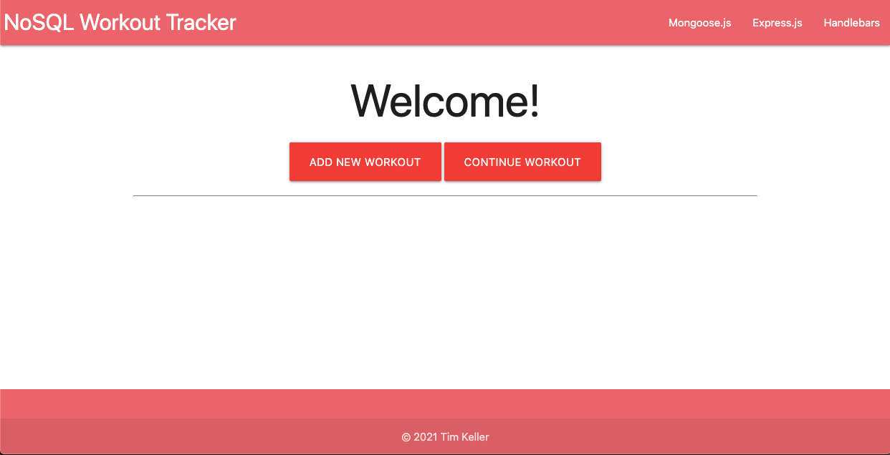

# NoSQL Workout Tracker

## Table of Contents
1. [Description](#description)
1. [Technologies](#technologies)
3. [Installation](#installation)
4. [Usage](#usage)
5. [Contributing](#contributing)
6. [Tests](#tests)
7. [Questions](#questions)
8. [License](#license)
## Description
Workout tracker for daily workouts. Built with MongoDB/Mongoose, Node.js, Express.js, and Express Handlebars for the University of Washington Winter 2020/21 Coding Bootcamp.

## Technologies

## Installation
Clone the git into your directory of choice. Type npm i to install all dependencies.

## Usage
Use npm start, node server.js, or nodemon server.js from the home directory, depending on whether you are running the app remotely, from locally, or for development, respectively. For localhost, the app is coded to run on port 8080. Navigate to localhost:8080/seedworkouts to seed the site with example workouts, or begin creating your own. Press the big red button on the left to create a new workout. From there, you'll be able to add new exercises using the form (which should immediately populate in the area below), or delete your workout to start over. The MongoDB schema will save your exercises and workouts, so you're free to add to them and persue them at your leisure.

[Live site demo](https://tmk-nosql-workout-tracker.herokuapp.com/)

## Contributing
Fork this repository on Github: https://github.com/tmkeller/NoSQL-Workout-Tracker. Email me at timothy.m.keller@gmail.com to discuss pull requests.

## Tests
No testing suite designated at this time.

## Questions
Written by [tmkeller](https://github.com/tmkeller) on Github.
Email the author at timothy.m.keller@gmail.com.

## License
[CC0](http://creativecommons.org/publicdomain/zero/1.0/)